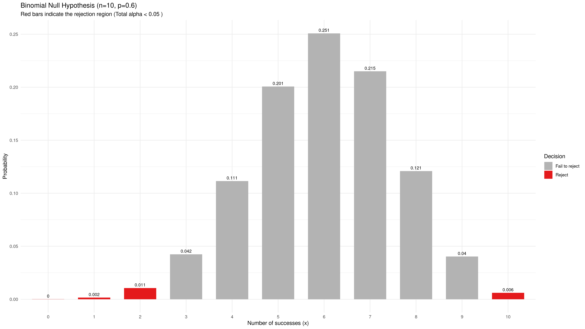
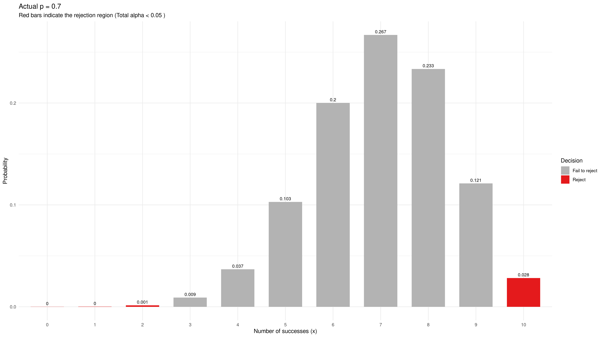
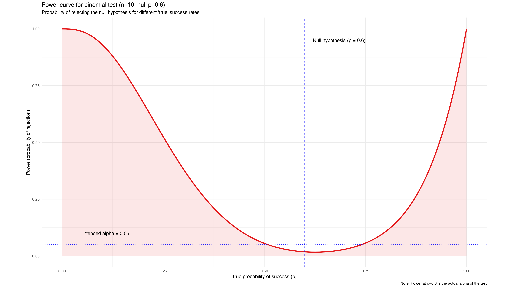
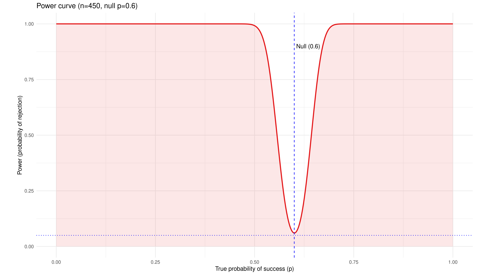
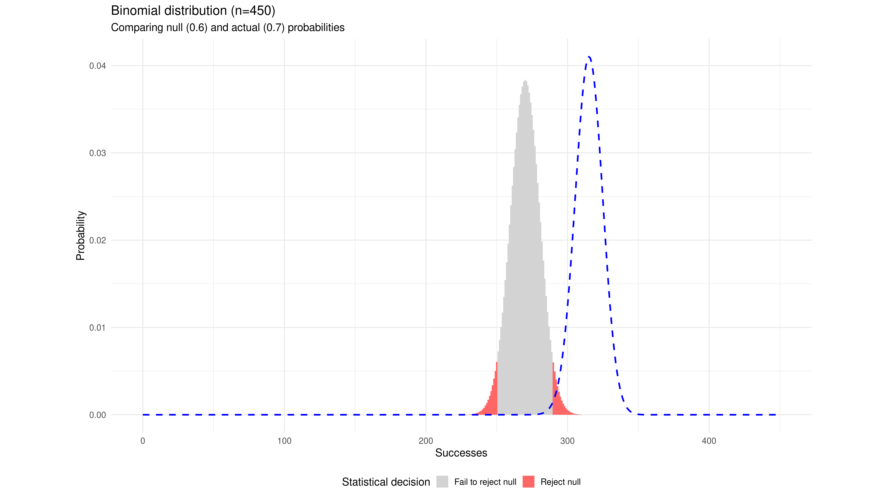

Many years ago, towards the end of the Cold War, I was an analyst at a defense research 
establishment. I built, maintained, and ran discrete event simulation models of 
large-scale air warfare, effectively modeling the Third World War in the airspace 
over Europe.

These were large and complex models. My Master's thesis was on embedding 
a non-linear resource allocation model for prioritization between different possible 
mission types given the current state of the simulated combat inside one of these models. 
This represented the decisions of a human air commander, while an actual Air Vice Marshal 
was looking over my shoulder sharing helpful and specific advice like "Hey! I 
wouldn't have done _that!_" (Afterward, I also found out that having one's Master's 
thesis classified for reasons of national security is somewhat inconvenient for later 
career reference.)

Our task was to give recommendations to senior decision-makers on important choices
that could involve billions of dollars in peacetime cost and would have
life-or-death consequences if the Cold War had turned hot. Moreover, some of these
choices had their proponents and detractors with strong and vocal opinions, and 
with varying numbers of stars on their shoulderpads. No pressure whatsoever.

We were running these simulations on a cluster of VAXstations. These were powerful 
workstations for their time, providing about 11 MFLOPS from a single CPU 
core. For comparison, a 2016 Apple Watch gave about 1 200 MFLOPS from its quadcore 
ARM Qualcomm CPU.

Quite literally, we were running large, complex high-stakes simulations on hardware with 
less than 1 % of the computing power that a ten-year-old wristwatch has today.

Suppose, for the sake of the argument that there is a thing to evaluate. It could 
be a device, a tactic, a training program - whatever. Suppose also that the main 
outcome metric is a probability, e.g., of "winning" (whatever that means in the 
relevant scenario). As always, the proponents of the thing claim that it is the 
greatest thing since the invention of gunpowder, while the detractors think it could 
lose us the whole war in an afternoon.

So we load up the simulation, run it... and blue "won"! Success!

To which the Chief Scientist, who has seen things before, sagely comments, "That 
is just a single replication. Is it statistically significant?"

Good question. We pull out the Statistics 101 textbook and flip to the chapter on 
the binomial hypothesis test. We determine that the _a priori_ probability of 
"winning" without this new thing is about 0.6. That will do as our null hypothesis. We 
want to be scientific, so we want a 95 % confidence level, or $\alpha = 0.05$. And the 
proponents and detractors of the thing are about equally loud, so we probably need a 
two-sided test just in case. Our computing resources are still rather limited, so running 
ten replications is about as much as we can manage. Working out the probabilities, we find 
that we can reject the null hypothesis $p = 0.6$ if we have 0, 1, or 2 successes, or if we 
have exactly 10 successes.

So we load up the simulation, run all 10 replications, come back on Monday, and find 8 
successes. Not a significant result, made nobody happy. Trying again, got 5 the second 
time. None the wiser.

Under our null hypothesis, $p = 0.6$, our binomial distribution looks something like this:

The probability of falsely rejecting the null hypothesis is about 0.02, somewhat less 
than our target $\alpha = 0.05$ due to the discrete distribution. Including one more 
bar on either side would bring us above that value. 

Suppose the actual (but unknown) probability of winning with this new thing is 0.7 
instead of the initial 0.6. That might be a small but useful improvement, about 0.2 
standard deviations. The binomial distribution of wins among our 10 
sample values is now like this: 

There is only about 3 % probability of detecting that this now is _different_ from the 
null hypothesis, and that includes a rather uncomfortable non-zero probability of 
concluding in the wrong direction from the actual effect.

Either way, our estimate of $p$ from a "statistically significant outcome" would wildly 
misjudge the actual effect size, such as $\hat{p} = 10/10 = 1.0$ or $\hat{p} = 2/10 = 
0.2$ (or even worse). The proponents or the detractors would feel vindicated – 
"Look, that's what I told you!" – but the result would not be anywhere near true.

We can plot the probability of rejecting the null hypothesis $p = 0.6$ as a function 
of the actual (unknown) success probability, as shown in the chart below. This is 
called a _power curve_, showing the experiment's statistical power to resolve 
true differences from the null hypothesis. 

This one is seriously underpowered. Note that a wide area between 0.5 and 0.75 has 
less probability of recognizing a real effect than our acceptable $\alpha = 0.05$. It 
is even asymmetric with the lowest probability for rejecting the null hypothesis at 
0.063, slightly higher than the null hypothesis itself. Our test is virtually blind to 
small changes, only able to reliably detect extreme values like $p < 0.1$ or $p > 0.95$.

***

But what if we could, say, implement our simulation model in a programming language that 
happened to run 45 times faster than this baseline, all else equal? For the same 
budget of time and computing resources, we would then be able to run 450 replications 
instead of 10. Our power curve now turns into a precise notch filter, with a 
near-certain ability to detect any effect larger than 0.1 from our null hypothesis 
$p = 0.6$. 

We can also plot the binomial test again for the null hypothesis $p = 0.6$, now with 
$n = 450$, and plot the sample distribution for an actual $p = 0.7$ in the same chart. 
This is a value just on the "shoulder" of the power curve. Almost the entire distribution 
of actual sample values now falls well outside the non-rejection region for our null hypothesis.

Our hypothetical 45x faster simulation has changed a blunt and opaque instrument into 
a high-powered magnifying glass. The improved speed translates directly into higher 
statistical power and higher analytical resolution.

This "hypothetical" 45x speed increase is the exact speed difference we have seen when 
benchmarking discrete event simulation models in C using the Cimba library against 
equivalent models in Python using SimPy and Python Multiprocessing. The increased 
statistical power too.

One might argue that "well, but we have so much more computing power now, so we can 
afford to be inefficient and slow." I beg to differ. Analysts (and their clients) will 
always try to include more realistic model features up to a point where computing  
speed becomes a constraint. For example, in my models from around 1990, we modeled  
airborne sensors as simple pie slices moving in two-dimensional airspace. What if one 
wanted higher realism, e.g., to model the dynamic three-dimensional sensor coverage  
from a maneuvering plane and the sensor cones from any approaching missiles, too? And 
perhaps replace my simple non-linear resource allocation model with something much more 
sophisticated for a more realistic representation of the human decision maker? Suddenly, 
the analyst is back to queueing for computer time in the time-honored fashion.

Speed is indeed (statistical) power.

***

One may also wonder how we actually were able to draw any conclusions at all back in 
the day, running such underpowered statistics on underpowered hardware. I think the  
practical approach could best be described as "informally Bayesian." There was not  
enough power for proper frequentist hypothesis testing of each scenario, but over time,
we ran hundreds of simulations with various parameter values. That gave a keen sense  
of what was "typical" model outputs and what was most likely a statistical fluke. If 
something looked strange, we would run additional replications and variations around 
that point in the parameter space to try to understand what was going on. I still 
believe that we mostly were able to draw the correct conclusions out of the foggy 
glass we had.